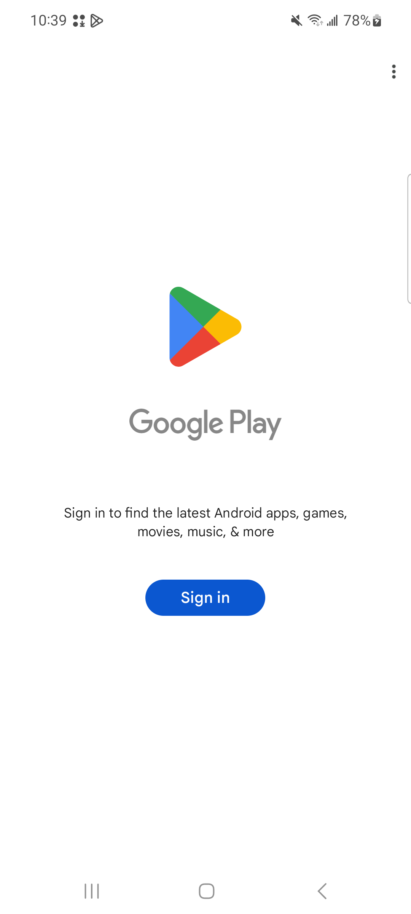
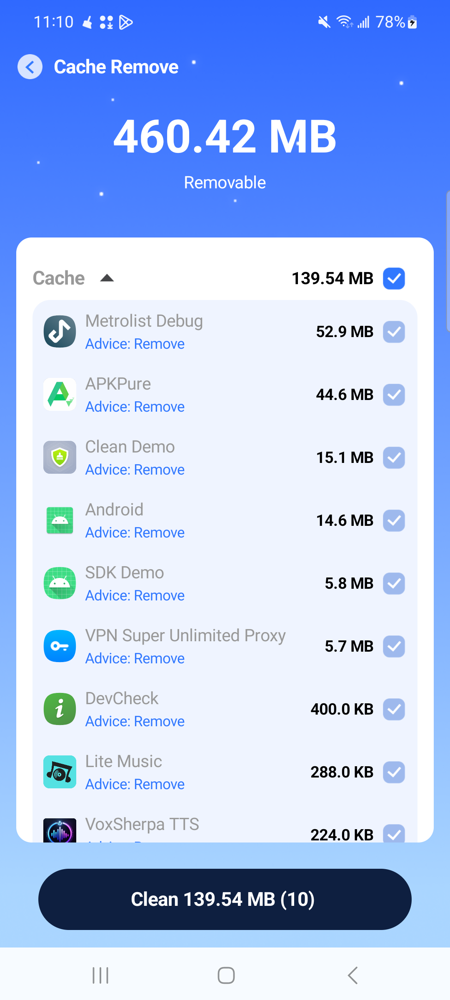

# AuraClean V1.1.5 实战记录

## 样本信息

```text
输入：E:\tem\auraclean_xapk\AuraClean.xapk
应用名：AuraClean
包名：com.auraclean.clean
版本：V1.1.5 (versionCode 16)
minSdk：24
targetSdk：35
启动 Activity：gol.zli.mcc.activitys.MainActivity
设备：Samsung SM-A716U
系统：Android 13 / API 33
XAPK 原生库：armeabi-v7a
```

原始主 APK 签名证书 SHA-256：

```text
9B6126185D9E673BE0D9FD4E863D40B008F6A60371FBA58CF2947B81A6F417D4
```

## 原包动态现象

安装主 APK、`armeabi_v7a`、`hdpi`、英文和中文 split 后，启动应用会进入未登录的 Google Play，而不是 AuraClean 主页面。



这说明必须继续区分：是业务 Activity 主动跳转，还是 Application 创建阶段触发的许可证组件。

## Manifest 入口

使用 `aapt2 dump xmltree` 读取原始二进制 Manifest：

```text
E: application
A: android:name="com.pairip.application.Application"
```

应用启动时，Android 会先实例化这个类。

## 包装类继承关系

反汇编结果：

```smali
.class public Lcom/pairip/application/Application;
.super Lgol/zli/mcc/FeiApplication;
```

构造方法也直接调用业务父类：

```smali
.method public constructor <init>()V
    .locals 0
    invoke-direct {p0}, Lgol/zli/mcc/FeiApplication;-><init>()V
    return-void
.end method
```

因此继承链是：

```text
android.app.Application
  -> gol.zli.mcc.FeiApplication
    -> com.pairip.application.Application
```

## 你记得的“方法修改”是什么

PairIP 包装类覆盖了 `attachBaseContext()`：

```smali
.method protected attachBaseContext(Landroid/content/Context;)V
    .locals 0

    invoke-static {p1}, Lcom/pairip/licensecheck/LicenseClient;->checkLicense(Landroid/content/Context;)V
    invoke-super {p0, p1}, Lcom/pairip/application/Application;->attachBaseContext(Landroid/content/Context;)V
    return-void
.end method
```

真正触发 Google Play 检查的是：

```smali
LicenseClient.checkLicense(context)
```

理论上可以修改这个方法，去掉 `invoke-static`。但这会改变 `classes2.dex`，需要重新编译和扩大验证范围。

## 本次为什么没有修改方法

既然 PairIP 类只是业务 Application 的包装层，就可以让 Android 直接创建业务 Application：

```xml
<!-- 原始 -->
<application android:name="com.pairip.application.Application" ... />

<!-- 修改后 -->
<application android:name="gol.zli.mcc.FeiApplication" ... />
```

修改后运行顺序变为：

```text
Android
  -> 创建 gol.zli.mcc.FeiApplication
  -> 执行业务初始化
  -> 创建 MainActivity
```

PairIP 包装类仍然留在 DEX 中，但系统不再实例化它，所以它的 `attachBaseContext()` 和 `checkLicense()` 调用不会执行。

## 如何确认 FeiApplication 是正确业务类

不能只凭名字猜测，应同时满足：

1. PairIP 包装类的 `.super` 明确指向它。
2. 它自身继承 Android Application。
3. 它包含业务初始化和静态实例字段。
4. 大量业务类引用 `Lgol/zli/mcc/FeiApplication;`。
5. 恢复后应用能冷启动且没有业务初始化崩溃。

## 修改范围

实际只修改一个 Manifest 属性：

```text
android:name="com.pairip.application.Application"
    ->
android:name="gol.zli.mcc.FeiApplication"
```

没有删除或修改：

- PairIP 类
- `attachBaseContext()` 方法体
- `FeiApplication` 方法
- MainActivity
- 清理业务代码
- 任何 `classes*.dex`

## DEX 完整性

```text
classes.dex
7D63A8ED62BDF5DA6280E0FED374A5002EF106AC46A5FC905EAC776323D45179

classes2.dex
C8840541CF64B9233642D1EA78AD931CA5CFC196224A29C2C5C9537BB4C1F14E

classes3.dex
AFED18D16804D51FB3A0D97C5660C644B99EC9CFF10A4AB1F75F21A3B45D888E

classes4.dex
F276C04F6A08714BAA2F1C74818DD262D10889436F76044E35DEAC66C5198DB0
```

原包与实验版全部一致。

## 实验版安装集合

```text
C:\Users\a\auraclean_analysis\patched\com.auraclean.clean.apk
C:\Users\a\auraclean_analysis\patched\config.armeabi_v7a.apk
C:\Users\a\auraclean_analysis\patched\config.hdpi.apk
C:\Users\a\auraclean_analysis\patched\config.en.apk
C:\Users\a\auraclean_analysis\patched\config.zh.apk
```

安装命令：

```powershell
$patched = 'C:\Users\a\auraclean_analysis\patched'

adb install-multiple --no-incremental -r `
  "$patched\com.auraclean.clean.apk" `
  "$patched\config.armeabi_v7a.apk" `
  "$patched\config.hdpi.apk" `
  "$patched\config.en.apk" `
  "$patched\config.zh.apk"
```

## 动态结果

修改后：

- 前台 Activity 是 `gol.zli.mcc.activitys.MainActivity`。
- `com.auraclean.clean` 进程持续存活。
- 没有 PairIP 许可证日志或崩溃。
- 可以进入 Cache Remove 页面并完成扫描。



## 最重要的复盘

这份样本需要阅读和理解一个方法，但不需要修改方法。逆向分析中的“发现问题位置”和“选择最终补丁位置”不是一回事：

```text
问题位置：PairIP attachBaseContext() -> checkLicense()
最小补丁：Manifest Application 恢复为业务父类
```

当一个更小的清单修改可以完全绕开包装层时，应优先保留业务 DEX 不变。

